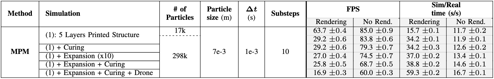
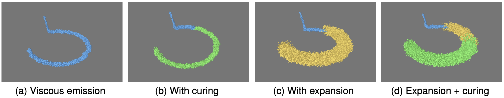
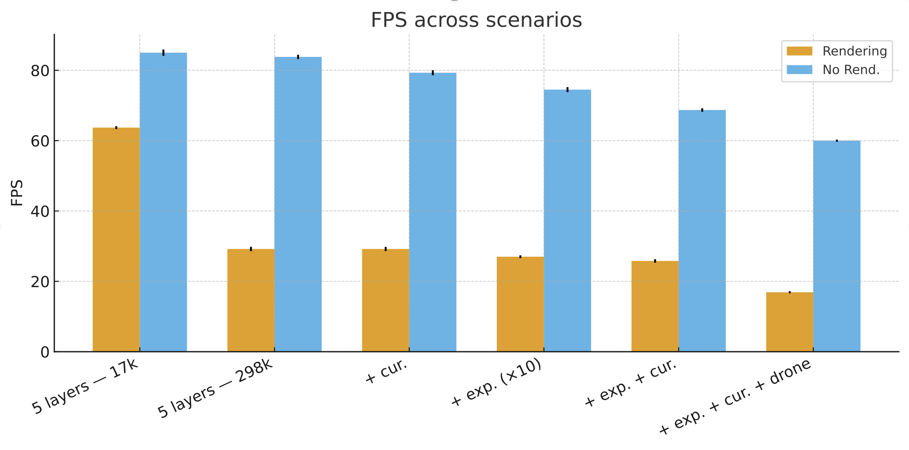
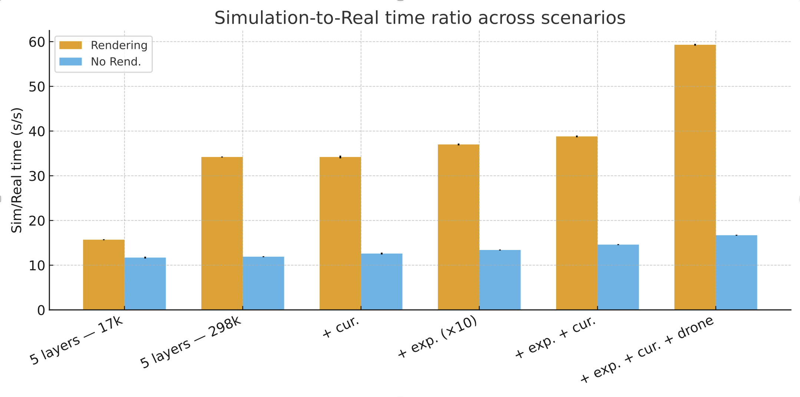

# Physics-Based Simulator for Aerial Additive Manufacturing  
2024 • *Simulating expanding, curing foams for drone-based 3D printing.*

<video src="cover/cover.mp4" controls autoplay muted loop playsinline height="50vh"></video>

---

## Overview

This project builds a **physics-based simulator** for **Aerial Additive Manufacturing (Aerial AM)**: 3D printing using drones that deposit a **viscoelastic, expanding foam**.

The goal is to:

- Model how the material **flows, expands, and cures** after it leaves the nozzle.  
- Use a fluid model that stays **stable** even with large deformations.  
- Run everything on a **GPU** so we can reach high frame rates and later use it for **reinforcement learning** or digital twins.

The simulator is implemented in **Genesis**, a GPU-native physics engine that supports several fluid models.  
We mainly use the **Material Point Method (MPM)**, which is well suited for simulating:

- Thick, sticky fluids  
- Volumetric expansion (foam-like behavior)  
- Transition from liquid to solid (curing)  

In simple words:  

> A drone flies in a circle and sprays a special foam. In the simulator, this foam first behaves like a thick liquid, then expands, then solidifies into a load-bearing structure — all computed from the physics.

---

## Demo videos

I will add the real videos later.  
Here are the placeholders and order I will use:

### 1. Transition to curing (same material, no expansion)

<video src="videos/curing-transition.mp4" controls autoplay muted loop playsinline height="50vh"></video>

### 2. Expansion only (no curing)

<video src="videos/expansion-only.mp4" controls autoplay muted loop playsinline height="50vh"></video>

### 3. Expansion + curing + drone (cover)

<video src="cover/cover.mp4" controls autoplay muted loop playsinline height="50vh"></video>

---

## Evaluation images

### Qualitative evaluation (single images)

### Side-by-side comparison

  
  

---

## What we simulate

We focus on a simple but representative printing task:

- A drone follows a **circular toolpath** at a fixed height.  
- At each lap it deposits **one ring** of material.  
- Stacked rings form a **cylindrical tower**.  

The drone’s motion is **kinematic** in this project:

- We do not simulate flight control yet.  
- The drone is there to show where the nozzle is and to interact with the fluid as a rigid body in some scenes.

The printed material is modeled as:

- A **viscoelastic fluid** when fresh (it can flow and merge with neighbors).  
- A **stiffer, solid-like material** after curing (it can carry weight).  
- Optionally **expanding**, like a foam that increases its volume over time.

We assume:

- Uniform gravity.  
- A rigid ground plane.  
- A finite simulation box that contains the whole process.  
- Particles that leave the box bounce off its walls.

---

## Why MPM and not SPH or PBD?

Genesis supports three main fluid approaches we considered:

- **MPM (Material Point Method)** — hybrid **particle + grid** method.  
- **SPH (Smoothed Particle Hydrodynamics)** — pure **particle** method.  
- **PBD (Position-Based Dynamics)** — **constraint-based** particle method.

We need a model that can:

- Represent **thick, sticky** material.  
- Handle **large deformations** and **layer stacking**.  
- Support a **liquid → solid** transition (curing).  
- Work with **expansion** without blowing up numerically.

**MPM** is the best fit for this:

- Particles carry mass and material state (position, velocity, deformation, etc.).  
- A background grid is used to compute forces and update the continuum mechanics.  
- It naturally supports **viscoelastic** and **elasto-plastic** behavior.

The main trade-off: MPM is **heavier** than PBD in terms of computation and memory, but the extra cost buys us much better physical realism.

---

## Stability constraints in MPM (time step and grid)

In MPM, stability depends on:

- Grid cell size $\Delta x$  
- Material parameters (density $\rho$, Young’s modulus $E$, Poisson’s ratio $\nu$, viscosity $\eta$)  
- The simulation time step $\Delta t$

Two main constraints limit $\Delta t$:

1. **Elastic wave constraint** (information cannot travel too far in one step):

   $$
   \Delta t \le \alpha_\text{el} \frac{\Delta x}{c} \quad\text{with}\quad
   c = \sqrt{\frac{K + \tfrac{4}{3}G}{\rho}}
   $$

   where $K$ = bulk modulus and $G$ = shear modulus, given by

   $$
   K = \frac{E}{3(1 - 2\nu)}, \qquad
   G = \frac{E}{2(1 + \nu)}.
   $$

2. **Viscous constraint** (diffusion must remain stable):

   $$
   \Delta t \le \alpha_\text{visc} \frac{\rho\,\Delta x^2}{\eta}.
   $$

We choose:

$$
\Delta t \le \min\left(
\alpha_\text{el} \frac{\Delta x}{c},
\;
\alpha_\text{visc} \frac{\rho\,\Delta x^2}{\eta}
\right),
$$

with safety factors $0 < \alpha_\text{el}, \alpha_\text{visc} < 1$.  
If needed, we also use **sub-stepping** inside each time step to keep the simulation stable during strong events (like sudden expansion or curing).

For the experiments in the paper, we fixed:

- Particle size: about $7 \times 10^{-3}\,\text{m}$  
- Grid density: $64$ cells per meter  
- Time step: $\Delta t = 10^{-3}\,\text{s}$  
- Substeps: $10$ per frame  

These values were chosen to be safe for the **most demanding** scenario (expansion + curing + drone). All other cases reuse the same settings so we can compare them fairly.

---

## How curing and expansion are modeled

A key idea in this simulator is to treat **curing** and **expansion** as **time-scheduled transitions** on a per-particle basis.

Each particle stores:

- Its **birth time** $t_\text{birth}$  
- Its **material state** (viscosity, stiffness, etc.)

At each step, we compute its **age**:

$$
\text{age} = t - t_\text{birth}.
$$

When the age crosses a threshold, we **promote** the particle to a new material state.

### Curing

Curing is implemented as a **one-to-one** promotion:

- Fresh particles live in a “liquid” pool.  
- After a delay $T_\text{cure}$ (plus a small random jitter to avoid everything curing at the same instant), a particle is copied into a “cured” pool.  
- Its position, velocity, and deformation history are preserved.  
- Only the **material parameters** change (higher stiffness, higher viscosity, possibly a yield stress).

We can also do curing in **multiple stages**, gradually increasing stiffness instead of jumping directly from liquid to fully solid.

### Expansion

Expansion is modeled as a **one-to-many** transition:

- After a delay $T_\text{expand}$, a particle is replaced by several “offspring” particles to represent increased volume.  
- New particles are sampled randomly inside a small sphere around the parent.  
- They inherit the parent’s velocity plus a small **outward impulse** and some noise, so the foam does not just grow perfectly spherical.  
- To **conserve mass**, the density of expanded particles is scaled by the inverse of the expansion ratio.

In simple terms:

> A particle waits, then “bursts” into a small cloud of children that represent the expanding foam.

All transitions use **pre-allocated particle pools** on the GPU.  
We never allocate new memory during runtime — we just **activate** or **deactivate** slots. This keeps the simulator fast and stable even when the number of particles grows a lot.

---

## Experimental setup and scenarios

All runs are 3D simulations using MPM in Genesis, executed on a **single GPU** (RTX-class).

We test several scenarios:

1. **Base deposition only** – viscous material, no curing, no expansion.  
2. **Base + curing** – layers stiffen over time.  
3. **Base + expansion** – material grows in volume (foam).  
4. **Base + expansion + curing** – expanding foam that later solidifies.  
5. **Base + expansion + curing + drone geometry** – full scene with the drone body included as a rigid collider.

For each run we log:

- **Physical metrics**  
  - Ring radius and drift  
  - Layer height and tower height  
  - Bead width  
  - Total mass (to check conservation)  
  - Whether the structure **stays stable** after deposition  

- **Performance metrics**  
  - Number of particles  
  - Frame rate (FPS)  
  - Simulation-to-real time ratio (seconds of simulation per second of wall time)  
  - Performance with and without rendering

---

## Main results and takeaways

Some key observations:

- **Particle count** strongly affects performance when rendering is enabled.  
  - More particles → lower FPS, higher Sim/Real ratio.  
- **Headless runs (no rendering)** are much more stable and scalable.  
  - FPS stays high even with many particles.  
  - This is ideal for large-scale data generation and reinforcement learning.  
- **Curing** adds only a small computational overhead.  
- **Expansion** is more expensive because it increases the number of particles.  
- **Expansion + curing + drone** is the most demanding case, but still runs at usable speeds with fixed settings.

Visually and physically, the simulator reproduces:

- Layer-by-layer build-up of the tower.  
- Foam that **settles**, **expands**, then **stiffens**.  
- A final structure that can carry load and stay upright.

The main simplification is how expansion is implemented: the foam grows by **spawning particles around existing ones**, not by directly pushing air out of the way. This makes the math and the implementation much simpler, while still giving believable foam-like behavior.

---

## What this simulator enables

This framework is a **first step toward a digital twin** for Aerial AM:

- We can test different **toolpaths**, **material schedules**, and **parameters** without flying a real drone.  
- We can evaluate **layer stability** and **shape accuracy** before going to the field.  
- Thanks to GPU acceleration, we can later run **many simulations in parallel** to train control policies or optimize process settings.

Future work will:

- Add full **drone dynamics and control**.  
- Calibrate material parameters with **real experiments**.  
- Scale to **multi-drone** scenarios and larger structures.  
- Use the simulator as a backbone for **reinforcement learning** and **online monitoring**.

In short, the project shows that it is possible to simulate **expanding, curing foams for drone-based 3D printing** in a way that is both **physically meaningful** and **computationally efficient**.