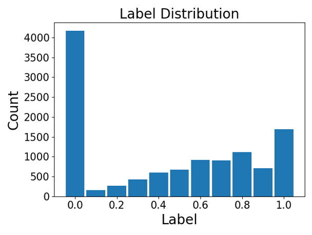
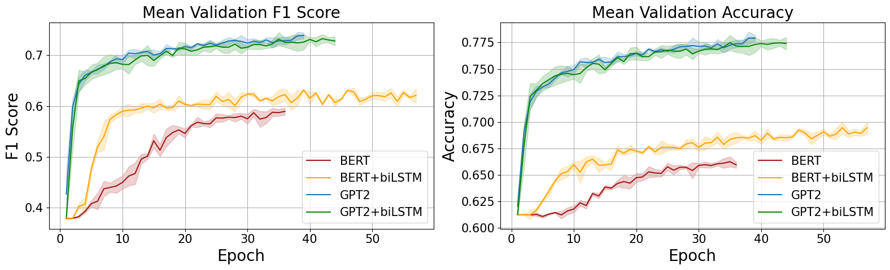

# Anticipating Hate Speech from Partial Input  
2024 • *Predicting how likely a sentence is to become hate speech while it is being written.*

---

## Overview

This project was done for the **EE-559 Deep Learning** course at EPFL (Group 30).

Instead of only labeling finished sentences as *hate / non-hate*, we try to estimate:

$$
P(\text{sentence is hateful} \mid x_{1:i})
$$

for every prefix $x_{1:i}$ of a sentence $x_{1:n}$ – basically:  

> “Given what has been written so far, how likely is the final sentence to be hateful?”

This could be used for **real-time moderation** in chats or comments, to intervene *before* the message is posted.

We compare two main model families:

- **BERT (encoder)** – strong at understanding and classifying text  
- **GPT-2 (decoder)** – strong at predicting the next tokens  

Sometimes we add a **biLSTM layer** on top of them, and we design **custom loss weights** so that:

- the model is less punished when only a few words are visible,  
- the model pays more attention to rare, clearly hateful prefixes.

---

## Model architecture

The pipeline is:

1. **Input**: a sentence prefix (partial text).  
2. **Transformer (BERT or GPT-2)**: turns tokens into embeddings.  
3. **Optional biLSTM**: captures how meaning changes along the prefix.  
4. **Classifier head**: outputs  
   - a **binary label** (hate vs non-hate) in phase 1,  
   - a **probability** in $[0, 1]$ in phase 2.

We test four variants:

- BERT  
- BERT + biLSTM  
- GPT-2  
- GPT-2 + biLSTM  

---

## Dataset strategy

Most hate-speech datasets only give a **binary label for the full sentence**.  
We want **probabilities for prefixes**, so we use two stages.

### Stage 1 – Large binary datasets

We train on several hate / non-hate datasets (forum sentences, offensive tweets, implicit hate).  
For each full sentence, we:

- cut it at a random position to create a **prefix**,  
- keep the same **binary label** as the full sentence.

This trains the models to answer: “Does this fragment *already* look like the beginning of a hateful sentence?”.

### Stage 2 – Hand-labeled prefix probabilities

We then build a smaller, more detailed dataset:

- Choose **600 sentences** from the Implicit Hate dataset.  
- For each sentence, create a sequence of prefixes.  
- For each prefix, manually assign a **probability in $[0, 1]$** for how likely the full sentence is to end up hateful.

Example:

| Sentence prefix                                | Label |
|-----------------------------------------------|:-----:|
| After you strip off                           | 0.0   |
| After you strip off his                       | 0.1   |
| After you strip off his makeup                | 0.3   |
| After you strip off his makeup, biologically  | 0.6   |

We also create a **separate test set** of ~400 prefixes with similar labels.

---

## Loss weighting: length and imbalance

Two issues appear:

1. Early prefixes are short and very ambiguous.  
2. Most prefixes are clearly non-hateful (labels near 0.0).

We modify the loss to handle both.

### 1. Length-based weight

To be more tolerant when the model sees only a few words, we scale the loss by:

$$
w_\text{len} = \frac{l_\text{prefix}}{l_\text{complete}}
$$

- Short prefix → small weight → less penalty.  
- Long prefix → large weight → more penalty (the model should be accurate).

This is used in **both** phases.

### 2. Label-imbalance weight

In the hand-labeled dataset, most labels are close to 0.  
We want the model to learn from the few high-probability prefixes, so we scale the loss by:

$$
w_\text{label} = C \cdot y
$$

where $y$ is the true label.  
So:

- If $y = 0$, loss is zero → no penalty for the many neutral prefixes.  
- If $y$ is high, loss is amplified → focus on risky prefixes.

For the hand-labeled data we combine both:

$$
w = 0.8 \, w_\text{label} + 0.2 \, w_\text{len}
$$

---

## Training and results

### Phase 1 – Binary training

- **Input**: prefixes from large binary datasets.  
- **Target**: hate vs non-hate.  
- **Split**: 85% training, 15% validation.

Results:

- **GPT-2** and **GPT-2 + biLSTM** perform best, reaching about  
  - accuracy $\approx 0.78$  
  - F1 score $\approx 0.74$  
- **BERT** is lower:  
  - plain BERT: accuracy $\approx 0.66$, F1 $\approx 0.58$  
  - BERT + biLSTM: accuracy $\approx 0.69$, F1 $\approx 0.62$

So GPT-2 is better when the task is **binary classification of fragments**, which matches its “next-token prediction” nature.

### Phase 2 – Probability fine-tuning

We then fine-tune on the **hand-labeled prefix probabilities**:

- **Input**: prefixes.  
- **Target**: probability in $[0, 1]$.  
- **Loss**: weighted MSE using the combined weight $w$.

Here the ranking changes:

- **BERT (no RNN)** achieves the **lowest MSE** on the test set.  
- Adding a biLSTM on top of BERT **hurts performance**, probably because it over-focuses on the last tokens.  
- GPT-2 models perform worse than BERT for this regression task.

The MSE is still quite high, which shows:

- the task is hard,  
- the dataset is small and subjective,  
- many prefixes are genuinely ambiguous.

---

## Example trajectories

Even with these limitations, the models show reasonable behavior.

**Neutral sentence:**

- “Immigrants bring” → low probability  
- “Immigrants bring new ideas and energy” → still low

**Potentially risky structure:**

- “I am not” → very low probability  
- “I am not sexist” → probability rises  
- “I am not sexist, but” → probability increases further

The model learns that patterns like “I am not X, but …” often precede problematic content, so the hate probability grows as the prefix develops.

---

## Takeaways

- **GPT-2 (decoder)** performs best for **binary classification** on partial input.  
- **BERT (encoder)** is better at producing **smooth probability scores** on our hand-labeled prefixes.  
- **RNN layers** help BERT a bit in binary training, but can hurt it when fine-tuning for probability regression.  
- The **custom loss weights** are important to:
  - be fair when context is short,  
  - overcome the strong label imbalance.

The system is far from perfect, but it shows that **anticipating** hate speech (not only detecting it after the fact) is possible. With:

- more and better labeled data,  
- larger models,  
- and maybe multi-annotator probability labels,

this kind of approach could be integrated into real-time interfaces to warn or block messages *before* they become harmful.