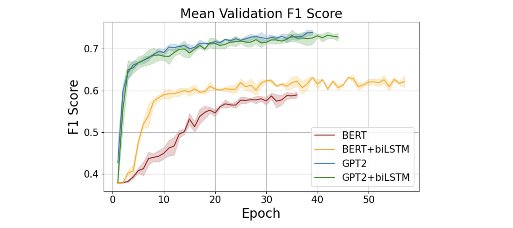

# AI Text-Audio Model Training for Hate Speech Prediction
_Deep Learning • 2023_

<!--  -->
<!-- <video src="cover/cover.mp4" controls autoplay muted loop playsinline></video> -->

## Overview
This project explored early detection of hate speech by combining acoustic cues with textual transcripts. We benchmarked different fusion strategies, optimized a custom training loop, and focused on minimizing false positives in sensitive conversations.

## Highlights
- Fine-tuned a transformer backbone on curated contextual hate speech datasets.
- Designed a fusion layer that learns joint representations from audio spectrograms and transcripts.
- Performed error analyses to balance sensitivity with conversational nuance.

## Notes
- Drop in figures that explain the fusion block when they are ready.
- Link the final lab report PDF once it is published.
