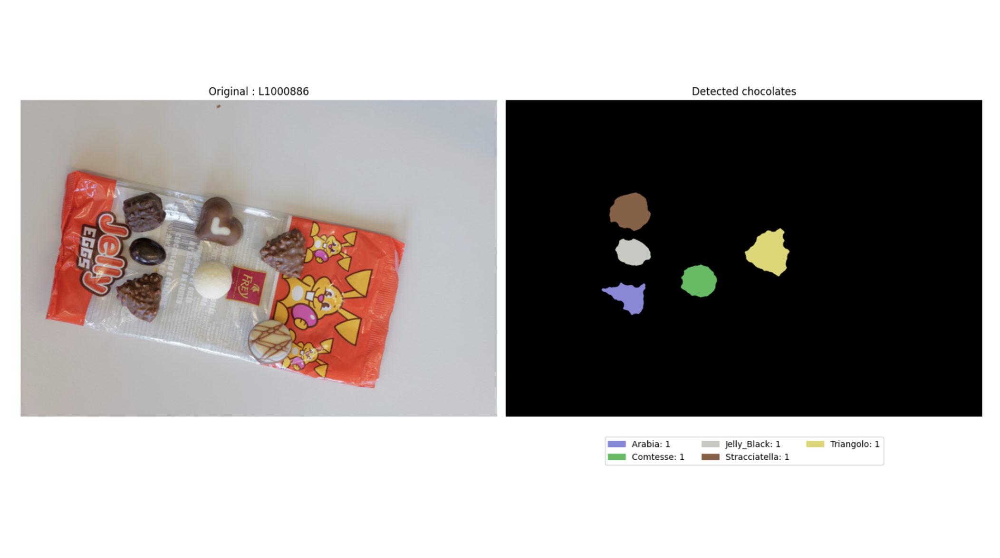

# Chocolate Recognition with Deep Learning
_Image Analysis • 2023_

<!--  -->
<!-- <video src="cover/cover.mp4" controls autoplay muted loop playsinline></video> -->

## Overview
Prepared a dataset of confectionery arrangements, applied aggressive augmentation, and trained a lightweight detector to separate overlapping sweets before counting instances.

## Highlights
- Automated labeling with synthetic arrangements to extend limited data.
- Applied color-constancy and histogram equalization for background invariance.
- Deployed the detector as a lightweight Flask demo for quick testing.

## Notes
- Add before/after augmentation collages in the media section when ready.
