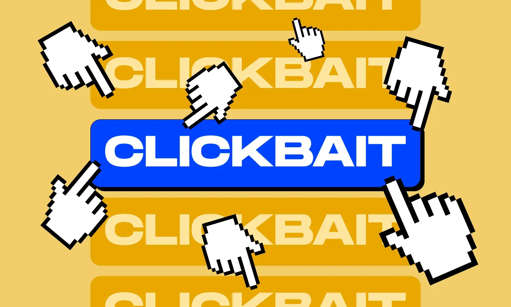

# Clickbait Data Analysis
_Independent • 2024 (This semester)_

<!--  -->
<!-- <video src="cover/cover.mp4" controls autoplay muted loop playsinline></video> -->

## Overview
Used the Youniverse dataset to engineer behavioral features, trained ML classifiers, and evaluated interpretability for content teams.

## Highlights
- Built a feature pipeline covering sentiment, timing, and creator history.
- Compared gradient boosting versus lightweight neural approaches.
- Delivered dashboards that visualize false-positive clusters for reviewers.

## Notes
- Add SHAP-style plots once the interpretability notebook is polished.
