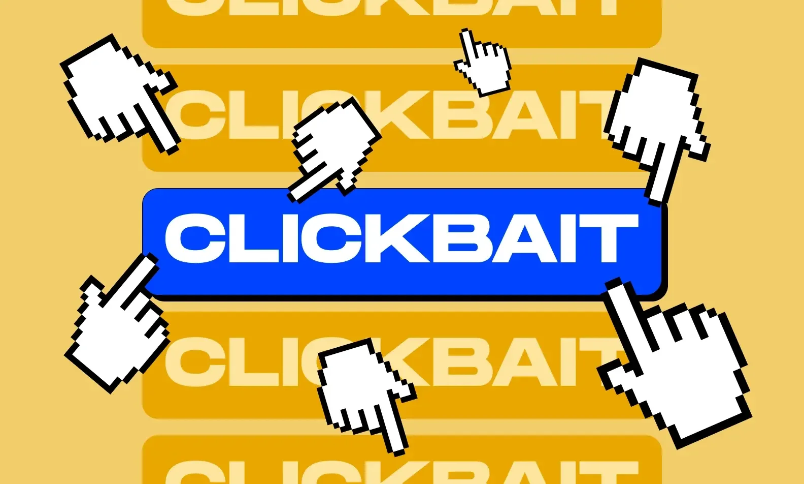

# Clickbait Data Analysis
2025 • *"You Won't Believe What We Found" — when and for whom clickbait works on YouTube.*

---

## Overview

Team project for EPFL's **Applied Data Analysis (ADA)** course, published as an interactive data story:

**→ [You Won't Believe What We Found: When and for Whom Clickbait Works on YouTube](https://epfl-ada.github.io/ada-2025-project-datahunt3rs/)**

We asked whether clickbait is just a manipulation tactic or a structural part of YouTube's economy: how prevalent is it, how much does it actually boost views and engagement, and does the payoff depend on a channel's size and content category?

---

## The Data

The analysis is built on the **YouNiverse dataset**:

* **136,470** English-language channels (>10k subscribers).
* **72.9M** videos with metadata (2005–2019).
* **18.9M** rows of weekly channel growth metrics (2015–2019).

---

## Spotting Clickbait

Since no ground-truth labels exist at this scale, we built a **hybrid clickbait classifier** for video titles:

* Trained on **32,000 labeled news headlines**, then adapted to YouTube using titles labeled by **Mistral-7B** as a teacher model.
* Features combine **n-grams** (catching phrases like "you won't believe") with **"scream factors"** — capitalization ratios, exclamation marks, and punctuation used as tokens.
* Reached an overall **76% F1-score** (up to 87% in Autos & Vehicles).

---

## What We Found

**Clickbait is everywhere, and growing.** 97.8% of channels published at least one clickbait video, and its share of uploads tripled from ~11% in 2005 to ~33% in 2019, rising in every content category.

**It works — for views.** Mann-Whitney U tests confirm the differences are significant, and OLS regressions controlling for duration, channel size, and video age associate clickbait titles with view lifts of up to **+81%** in categories like Autos, People & Blogs, and Entertainment — while engagement *rate* stays roughly stable: clickbait attracts volume rather than changing how the audience reacts.

**Small channels gain the most.** Splitting channels by size, the engagement boost from clickbait is largest for very small channels (**+50%**) and shrinks steadily toward very large ones (**+21%**) — clickbait is primarily an audience-acquisition tool.

**There is an optimal dose.** Quadratic regression models show an inverted-U relationship: too little clickbait leaves content invisible, too much erodes trust. The data story ends with concrete conservative/balanced/aggressive strategy recommendations per category and channel size.

---

## Verdict

Clickbait on YouTube behaves less like a scam and more like a measurable strategic tool — the data story's takeaway: *use the bait to be found, but use your voice to be remembered*.
