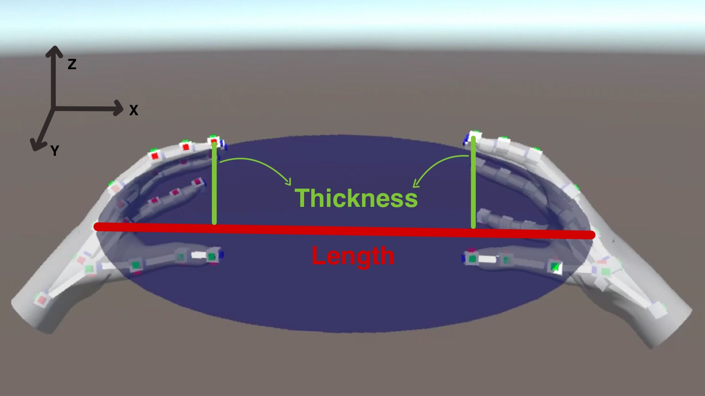

# Hand Gesture Control for Drone Swarms with VR  
2024 • *Move your hands in VR and watch a drone swarm change its shape and fly in a 3D formation.*

<!--  -->

<video src="cover/cover.mp4" controls autoplay muted loop playsinline height="50vh"></video>

---

## Overview

This project lets a person control a **swarm of drones** (real or simulated) using only their **hands**, tracked by a **Meta Quest 3S** in virtual reality.

- Your hands define a **3D ellipsoid** (a stretched sphere) that represents the **shape** and **orientation** of the swarm.  
- A modified **Olfati–Saber flocking algorithm** makes each drone move so that, together, they fill this ellipsoid.  
- The same idea works first in **simulation (VR)** and then on a **real Crazyflie swarm** using ROS2 and a wireless link.

In simple words:  

> You shape an invisible “bubble” with your hands, and the swarm tries to fill that bubble while flying.

---

## Demo videos

I will add the real videos later.  
Here is the order and the video tags so I can just plug in the right files:

### 1. Hands shaping the ellipsoid (no VR view)

<video src="videos/hands-ellipsoid.mp4" controls autoplay muted loop playsinline height="50vh"></video>

### 2. 2D hand-to-swarm control in VR

<video src="videos/vr-2d-swarm.mp4" controls autoplay muted loop playsinline height="50vh"></video>

### 3. 3D hand-to-swarm control in VR (same as cover)

<video src="cover/cover.mp4" controls autoplay muted loop playsinline height="50vh"></video>

### 4. Real swarm — shape control only (no velocity control)

<video src="videos/real-swarm-no-velocity.mp4" controls autoplay muted loop playsinline height="50vh"></video>

### 5. Real swarm — shape + velocity control

<video src="videos/real-swarm-velocity.mp4" controls autoplay muted loop playsinline height="50vh"></video>

### 6. Obstacle course qualitative evaluation

<video src="videos/Obstacle-course.mp4" controls autoplay muted loop playsinline height="50vh"></video>

---

## How the hands define a 3D ellipsoid

**Simple idea**

The VR headset gives me 3D positions of the **left** and **right** hands (palms and fingers). From that, I build a **virtual ellipsoid** that the swarm will try to match:

- The **center** of the ellipsoid is the midpoint between the two palms.  
- The **main axis length** depends on how far apart the hands are.  
- The **thickness** (the other two axes) depends on how much the fingers and hands are opened or closed.  
- The **orientation** of the ellipsoid depends on how you rotate your hands in space.

So:

- Move your hands apart → the ellipsoid gets longer.  
- Open or close your hands → it gets thicker or thinner.  
- Tilt / rotate your hands → the ellipsoid rotates in 3D.

**A bit of math (short version)**

Let the left and right palm positions be $p_L, p_R \in \mathbb{R}^3$.

- Ellipsoid center:  
  $$c = \frac{p_L + p_R}{2}$$

- Ellipsoid main length (distance between palms):  
  $$L = \|p_R - p_L\|$$

I also measure a “spread” value $T$ from the fingers (for example, how far the index fingertips are from the line between the palms).  
From $L$ and $T$, I define three ellipsoid axes (for 3D):  

$$(a_x, a_y, a_z) \propto (L,\; T,\; T)$$

To make this easier, I define a **hand-based coordinate frame**:

- $x_h$: from left hand to right hand  
- $z_h$: roughly aligned with “up”  
- $y_h$: completes the right-handed 3D frame

In that frame I can scale the ellipsoid along $x_h, y_h, z_h$, then rotate it back to world coordinates.

---

## How the swarm follows the shape

**Base idea: Olfati–Saber flocking**

Olfati–Saber is a classic algorithm for swarms. Each drone:

- Tries not to **crash** into neighbors (separation).  
- Tries to stay **close enough** (cohesion).  
- Tries to **align its velocity** with others (alignment).  

The total control for drone $i$ can be seen as:

$$u_i = f_{\text{cohesion},i} + f_{\text{alignment},i} + f_{\text{migration},i}$$

Where “migration” is the tendency to move in some desired direction or pattern.

### From 1 degree of freedom to 2D/3D shape control

In many original uses (and in previous work by Macchini et al.), the swarm has a **single distance parameter** $d_{\text{ref}}$. This tells drones how far they should stay from each other on average.

- If you **increase** $d_{\text{ref}}$: the whole swarm **expands** equally in all directions.  
- If you **decrease** $d_{\text{ref}}$: the swarm **shrinks** equally in all directions.

This means the operator only controls **1 degree of freedom (1 DoF)**: a single “scale” of the swarm.

In my project, I extend this to **2D and 3D**:

- In 2D:  
  $$d_{\text{ref}} = (d_x, d_y)$$

- In 3D:  
  $$d_{\text{ref}} = (d_x, d_y, d_z)$$

Each of these values tells the swarm how spread out it should be along one axis of the ellipsoid.

**Connection to the ellipsoid**

I map the ellipsoid axes to separation distances:

- $d_x$ is linked to the ellipsoid length (hands distance $L$).  
- $d_y$ and $d_z$ are linked to the ellipsoid thickness (hand openness $T$).

So the swarm no longer has one “spacing”; it has:

- A spacing along **hand-to-hand direction**.  
- A spacing in the **sideways** direction.  
- A spacing in the **vertical** direction (3D).

This lets the swarm:

- Stretch more in one direction than the others.  
- Flatten vertically.  
- Become tall and thin, or short and wide, depending on the hand pose.

---

## Adding velocity and diagonal motion

Shape is not enough: we also want the **whole formation to move**.

**Velocity from hand movement**

- The **midpoint** between the two hands controls the **desired swarm velocity**.  
- Around a neutral position, there is a **dead zone** where small movements are ignored.  
- When you move your hands further away from this neutral point, a velocity command is created in that direction.

For each drone:

$$f_{\text{alignment},i} = c_{\text{vm}} (v_{\text{des}} - v_i)$$

where:

- $v_{\text{des}}$ = desired swarm velocity from the hands  
- $v_i$ = current velocity of drone $i$  
- $c_{\text{vm}}$ = gain that controls how strongly the drone tries to match $v_{\text{des}}$

**Diagonal and rotated formations**

The orientation of the line between the two hands defines the **main axis direction** of the ellipsoid:

- I project the vector from left to right hand onto the horizontal plane and measure its angle.  
- This angle tells the swarm how to **rotate** its formation in space (e.g., a diagonal line instead of a straight line along x or y).

The drones do not move as a rigid block, but the **shape they try to form** is rotated.

---

## From VR to real Crazyflie swarms

The full pipeline is:

1. **Unity + Meta Quest 3 (Windows)**  
   - Reads hand tracking.  
   - Computes ellipsoid center, axes, and orientation.  
   - Converts these into separation distances $d_x, d_y, d_z$ and a desired velocity $v_{\text{des}}$.

2. **UDP bridge (Windows → Linux)**  
   - Sends a small packet with the shape and velocity data over the network.

3. **ROS2 + Crazyswarm2 (Linux)**  
   - Receives the commands.  
   - Runs the extended Olfati–Saber flocking control.  
   - Sends the resulting velocity commands to each Crazyflie over radio.

On real hardware, I show two kinds of experiments:

- **Without velocity control**: only the shape (distance along axes) changes, the swarm stays roughly in place.  
- **With velocity control**: the swarm both **moves** and **changes shape** at the same time.

---

## What this interface allows

With this hand-based interface, a single operator can:

- Compress the swarm to pass through **narrow openings**.  
- Stretch it along one direction to explore **corridors** or **tunnels**.  
- Spread it out laterally to **cover a wider area**.  
- Move the whole group while constantly reshaping it, using only **intuitive hand motions**.

There is no need to learn a long list of discrete gestures.  
You simply **“grab” the swarm with your hands in VR** and change its shape and motion directly.

---

<!-- ## Slides

 

    <iframe
        class="absolute top-0 left-0 w-full h-full"
        src="https://drive.google.com/file/d/1gQA6hAbqgnj5zFjis7ylmQk0A6h8QpmU/view?usp=sharing" 
        allowfullscreen
        title="Hand Gesture Swarm Deck"
    ></iframe>

 -->

<!-- "https://docs.google.com/presentation/d/1FshBk1suVUCHNCBTP1fp5eQhe4eJct6a/embed?start=false&loop=false&delayms=10000" -->