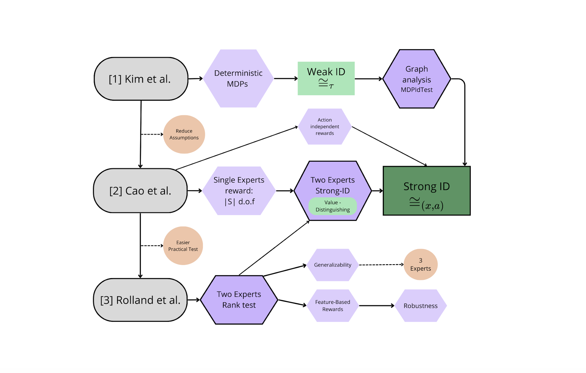

# Inverse RL Research
_Reinforcement Learning • 2024 (This semester)_

<!--  -->
<!-- <video src="cover/cover.mp4" controls autoplay muted loop playsinline></video> -->

## Overview
Surveyed MaxEnt IRL, adversarial approaches, and offline variants to propose practical heuristics that reduce demonstration requirements. Focused on reproducibility and lightweight evaluation harnesses.

## Highlights
- Benchmarked state-of-the-art IRL libraries on shared control tasks.
- Documented common failure modes tied to reward misspecification.
- Outlined research directions for safer covariate-shift handling.

## Notes
- Embed comparative plots of the IRL baselines when the experiments finish.
