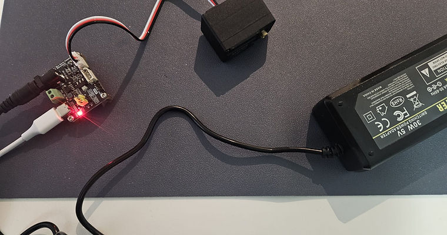
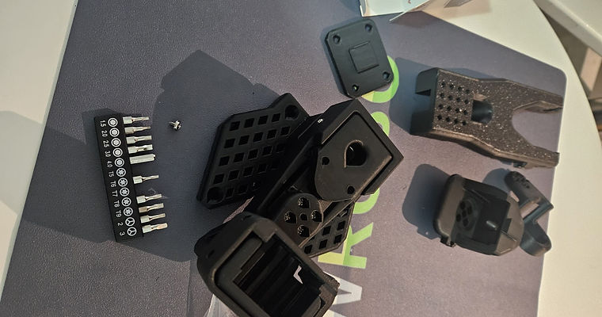
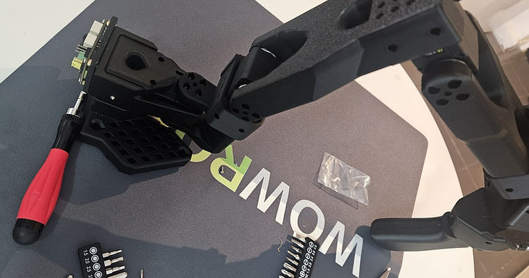
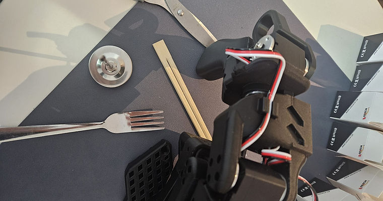

# LeRobot

2025 • *The project involves mechanical assembly, servo control, embedded programming, and software integration, with an emphasis on understanding how hardware and software interact in practical robotics systems.*

<video src="cover/cover.mp4" controls autoplay muted loop playsinline height="50vh"></video>

---

## Overview

**LeRobot** is a real-time teleoperation setup using a leader–follower robotic arm system.
The leader arm captures joint motions, which are mapped and mirrored live onto the follower arm through a custom control stack on Ubuntu.

This setup allows **intuitive, low-latency human control** and forms the foundation for **learning from demonstration**, where the robot can later learn to perform tasks autonomously based on these human-guided trajectories.

---

## Automation & Dataset Creation

After a large number of episodes are recorded (consisting of time-synchronised camera frames and robot actions), the data is consolidated into a single dataset.
Every episode is stored as an ordered sequence of observations, including:

- Image frames
- Actuator commands
- Relevant state information

This structured collection captures both successful executions and natural variation, providing a reliable foundation for training robotic control models.

---
## Videos

### 1. Imitation Learning in action
<video src="videos/lerobot_video_2.mp4" controls playsinline width="50%"></video>

---
## Gallery

  
  
  
  

