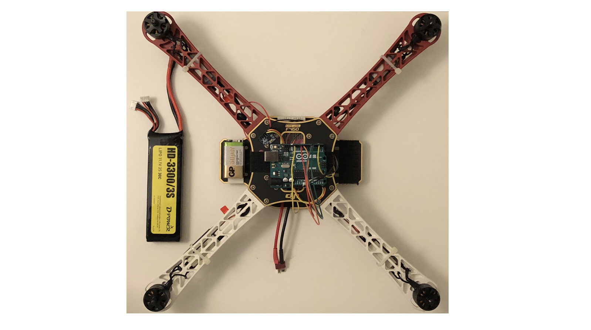

# Quadcopter Design and Stabilization
_Independent • 2020_

<!--  -->
<!-- <video src="cover/cover.mp4" controls autoplay muted loop playsinline></video> -->

## Overview
Produced CAD for the airframe, integrated IMU data, and tuned cascaded PID controllers to maintain hover despite lightweight frames.

## Highlights
- 3D-printed structural components and optimized them for weight and stiffness.
- Developed embedded firmware in C++ for sensor fusion across the 6-axis IMU.
- Calibrated PID gains using thrust-stand measurements and log replay.

## Notes
- Capture glamour shots of the printed frame once the wiring cleanup is done.
