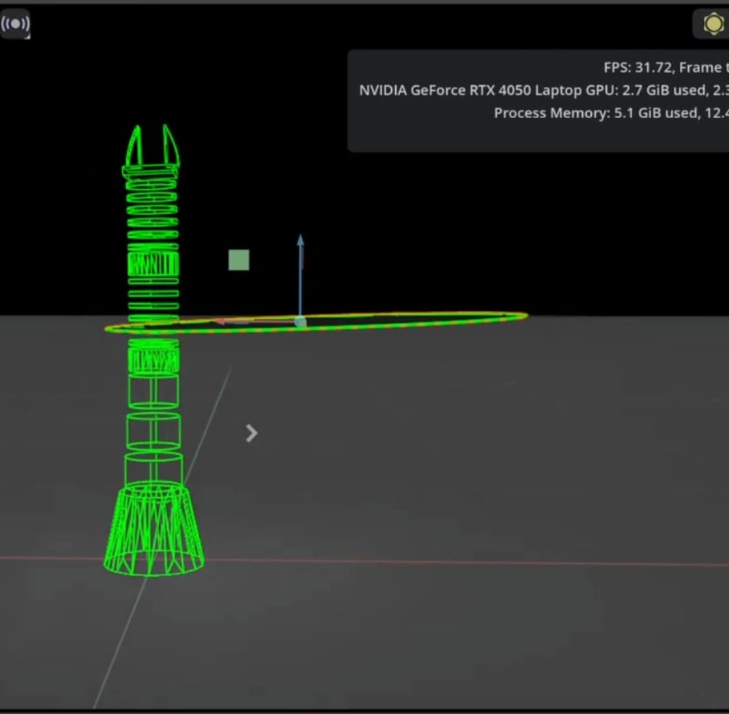

# Soft Robotic Arm: Sim-to-Real Digital Twin & RL
2026 • *Bridging the gap between a real soft robotic arm and Isaac Sim for Reinforcement Learning.*

<!--  -->

<video src="cover/cover.mp4" controls autoplay muted loop playsinline height="50vh"></video>

---

## Overview

This project focuses on the **Sim-to-Real transfer** of control policies for a **soft robotic arm**. The goal was to create a high-fidelity **Digital Twin** in **NVIDIA Isaac Sim** that accurately models the physics of a real tendon-driven arm, enabling the training of **Reinforcement Learning (RL)** policies that can be deployed on the physical hardware.

-   **Real Hardware**: A tendon-driven soft robotic arm with flexible joints.
-   **Simulation**: A physics-accurate Digital Twin in Isaac Sim.
-   **Control**: A shared controller based on Constant Curvature mapping.
-   **Goal**: Train RL policies in simulation and deploy them to the real world.

> The challenge: Approximating the complex non-linear dynamics of a soft, flexible arm in a rigid-body simulator to achieve the "least sim-to-real gap."

---

## From CAD to Digital Twin

The journey started with a real robotic arm that had no simulation environment.

### 1. Dissecting the Arm
I started by analyzing the CAD models of the real arm. The physical arm uses **flexible parts** that bend when pulled by tendons.
-   In the simulator (Isaac Sim), these continuous flexible deformations were approximated using **revolute joints**.
-   The tendons, which drive the motion in the real arm, were simulated as **motors/servomotors** acting on these joints.

### 2. Tuning Physics Parameters
The hardest part of the approximation was setting the **stiffness and damping** for each simulated joint to match the real world.
-   I used the real arm as a ground truth reference.
-   Iteratively tuned the simulation parameters until the dynamic behavior (bending, settling time, gravity compensation) matched the physical arm.

---

## The Shared Controller: Constant Curvature Mapping

To bridge the gap between the tendon-driven real arm and the joint-driven simulation, I implemented a unified control interface based on the **Constant Curvature (CC)** model.

**The Model**
The Constant Curvature model approximates how the soft arm bends. It assumes that for a given segment, the bending forms a circular arc.

**The Mapping**
-   **Real Arm**: I used **motion capture** to map the encoder torques and tendon lengths to the corresponding bending angles.
-   **Simulation**: The mapping of joint angles was done **1-to-1** with the CC model.

**Result**: A unified controller where the same command (e.g., "bend 30 degrees") produces the same physical result in both the simulator and the real robot. This effectively created a **Digital Twin**.

---

## Reinforcement Learning & Deployment

With the Digital Twin established, the environment was ready for AI training.

-   **Training**: I am currently training **Reinforcement Learning (RL)** policies in Isaac Sim. The agent learns to control the soft arm to reach targets or perform manipulation tasks.
-   **Deployment**: Because the simulation physics and control interface are tightly matched to the real world, the policy trained in simulation can be directly deployed to the real robot.

*The RL policy is currently a work in progress.*

<!-- Add more videos here as they become available -->
<!--
### 2. RL Training in Isaac Sim
<video src="videos/rl-training.mp4" controls autoplay muted loop playsinline height="50vh"></video>
-->

<!--  -->
